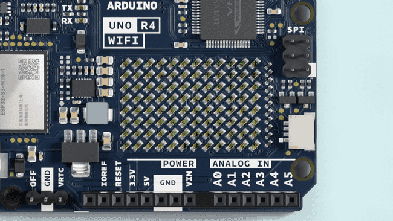
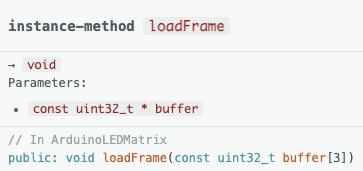
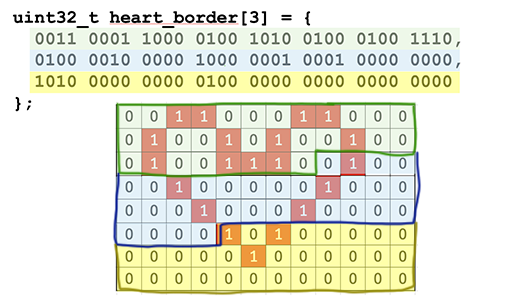

# Using the Arduino UNO R4 WiFi LED Matrix

เริ่มต้นใช้งาน Arduino UNO R4 WiFi ด้วยเมทริกซ์ LED ในตัว เรียนรู้เทคนิคต่างๆ ในการควบคุม สร้างแอนิเมชัน กราฟิก
หรือแม้แต่เกม

**Arduino UNO R4 WiFi** มาพร้อมกับเมทริกซ์ LED 12x8 ในตัว ซึ่งสามารถตั้งโปรแกรมเพื่อแสดงกราฟิก แอนิเมชัน
ทำหน้าที่เป็นส่วนเชื่อมต่อ หรือแม้แต่เล่นเกมได้

## Goals

เมทริกซ์และ API ได้รับการพัฒนาให้ตั้งโปรแกรมได้หลายวิธี แต่ละวิธีเหมาะสำหรับแอปพลิเคชันที่แตกต่างกัน
คู่มือนี้นำเสนอแนวคิดพื้นฐานสำหรับการเขียนโปรแกรมเมทริกซ์ LED และช่วยให้คุณเริ่มต้นสร้างแอนิเมชันของคุณเอง
พร้อมเน้นย้ำถึงสองวิธีในการจัดการ LED เพื่อสร้างแอนิเมชันและรูปภาพ
ทำให้คุณตัดสินใจได้ง่ายขึ้นว่าวิธีใดเหมาะสมกับความต้องการของคุณที่สุด!



## Hardware & Software Needed

- Arduino UNO R4 WiFi
- UNO R4 Board Package (latest version)
- Arduino IDE

## Initializing Your Arduino LED Matrix with Arduino_LED_Matrix Library

เอกสารนี้อธิบายขั้นตอนสำคัญในการเริ่มต้นใช้งานเมทริกซ์ LED 12x8 กับ Arduino ของคุณและไลบรารี `Arduino_LED_Matrix`

**Step 1: Include the Library**

ที่จุดเริ่มต้นของสเก็ตช์ Arduino (ไฟล์ `.ino`) ให้เพิ่มบรรทัดต่อไปนี้:

```cpp
#include "Arduino_LED_Matrix.h"
```

บรรทัดนี้รวมฟังก์ชันและคำจำกัดความที่จำเป็นจากไลบรารี `Arduino_LED_Matrix` ไว้ในโปรเจกต์
ไลบรารีนี้ช่วยลดความยุ่งยากในกระบวนการควบคุมและแสดงกราฟิกบนเมทริกซ์ LED

**Step 2: Create a Matrix Object**

ด้านล่างคำสั่ง `#include` ให้สร้างอินสแตนซ์ของคลาส `ArduinoLEDMatrix` ดังนี้:

```cpp
ArduinoLEDMatrix matrix;
```

This creates an object called `matrix` that represents your physical LED Matrix. You'll interact with this object to
send commands and display content on the matrix.

**Step 3: Initialize the Matrix in `setup()`**

ในฟังก์ชัน `setup()` จะทำงานครั้งเดียวเมื่อเริ่มต้นโปรแกรม ให้ประกาศเพื่อเริ่มต้นใช้งาน Matrix LED:

```cpp
void setup() {
  Serial.begin(115200);   // ตัวเลือก สำหรับการดีบัก
  matrix.begin();         // เริ่มต้นใช้งานเมทริกซ์ LED
}
```

- `Serial.begin(115200);` is optional but recommended for debugging. It starts serial communication so you can send
  messages from your Arduino to your computer.
- **The crucial line is `matrix.begin();`**, which initializes the `matrix` object and prepares the LED Matrix for
  receiving data and displaying content.

**Complete Initialization Code:**

```cpp
#include "Arduino_LED_Matrix.h"

ArduinoLEDMatrix matrix;

void setup() {
  Serial.begin(115200); 
  matrix.begin();
}

void loop() {
  // Add your LED matrix display code here!
}
```

ด้วยสามขั้นตอนนี้ LED Matrix จะแสดงกราฟิกหรือข้อความที่ควบคุมโดยโค้ดของเรา โดยที่เราจะต้องเขียนคำสั่งภายในฟังก์ชัน
`loop()` เพื่อใช้ในการควบคุม LED Matrix

## Create an image using Frame Gallery

ผู้พัฒนาได้ออกแบบแกลเลอรีของเฟรมและแอนิเมชันที่รวมอยู่ในไลบรารีแล้ว โดยที่เราสามารถโหลดและแสดงบน UNO R4 WiFi
ได้เลย:

```cpp
#include "Arduino_LED_Matrix.h"   // Include the LED_Matrix library

ArduinoLEDMatrix matrix;          // Create an instance of the ArduinoLEDMatrix class

void setup() {
  Serial.begin(115200);           // Initialize serial communication at a baud rate of 115200
  matrix.begin();                 // Initialize the LED matrix

}

void loop() {
  // Load and display the basic emoji frame on the LED matrix
  matrix.loadFrame(LEDMATRIX_EMOJI_BASIC);
}
```

โดยการเปลี่ยนพารามิเตอร์ใน `matrix.loadFrame()` ในลูปก็สามารถเลือกเฟรมที่มีให้เลือกใช้ได้

The available **frames** are:

- `LEDMATRIX_BLUETOOTH`
- `LEDMATRIX_BOOTLOADER_ON`
- `LEDMATRIX_CHIP`
- `LEDMATRIX_CLOUD_WIFI`
- `LEDMATRIX_DANGER`
- `LEDMATRIX_EMOJI_BASIC`
- `LEDMATRIX_EMOJI_HAPPY`
- `LEDMATRIX_EMOJI_SAD`
- `LEDMATRIX_HEART_BIG`
- `LEDMATRIX_HEART_SMALL`
- `LEDMATRIX_LIKE`
- `LEDMATRIX_MUSIC_NOTE`
- `LEDMATRIX_RESISTOR`
- `LEDMATRIX_UNO`

[//]: # (This code will cycle through all the available frames:)

[//]: # ()

[//]: # (```cpp)

[//]: # (#include "Arduino_LED_Matrix.h")

[//]: # ()

[//]: # (ArduinoLEDMatrix matrix;)

[//]: # ()

[//]: # (// Define an array of available frame names)

[//]: # (const char* frames[] = {)

[//]: # (  "LEDMATRIX_BLUETOOTH",)

[//]: # (  "LEDMATRIX_BOOTLOADER_ON",)

[//]: # (  "LEDMATRIX_CHIP",)

[//]: # (  "LEDMATRIX_CLOUD_WIFI",)

[//]: # (  "LEDMATRIX_DANGER",)

[//]: # (  "LEDMATRIX_EMOJI_BASIC",)

[//]: # (  "LEDMATRIX_EMOJI_HAPPY",)

[//]: # (  "LEDMATRIX_EMOJI_SAD",)

[//]: # (  "LEDMATRIX_HEART_BIG",)

[//]: # (  "LEDMATRIX_HEART_SMALL",)

[//]: # (  "LEDMATRIX_LIKE",)

[//]: # (  "LEDMATRIX_MUSIC_NOTE",)

[//]: # (  "LEDMATRIX_RESISTOR",)

[//]: # (  "LEDMATRIX_UNO")

[//]: # (};)

[//]: # ()

[//]: # (// Number of frames in the array)

[//]: # (const int numFrames = sizeof&#40;frames&#41; / sizeof&#40;frames[0]&#41;;)

[//]: # ()

[//]: # (// Current frame index)

[//]: # (int currentFrame = 0;)

[//]: # ()

[//]: # (void setup&#40;&#41; {)

[//]: # (  Serial.begin&#40;115200&#41;;)

[//]: # (  matrix.begin&#40;&#41;;)

[//]: # (})

[//]: # ()

[//]: # (void loop&#40;&#41; {)

[//]: # (  // Load and display the current frame)

[//]: # (  matrix.loadFrame&#40;frames[currentFrame]&#41;;)

[//]: # ()

[//]: # (  // Increment frame index for next cycle)

[//]: # (  currentFrame = &#40;currentFrame + 1&#41; % numFrames;)

[//]: # ()

[//]: # (  // Adjust delay as needed for desired frame rate)

[//]: # (  delay&#40;1000&#41;; // Change frame every 1 second)

[//]: # (})

[//]: # (```)

## Heart Bitmap Display on Arduino LED Matrix

โค้ดนี้จะแสดงรูปภาพ Bitmap รูปหัวใจบนเมทริกซ์ LED 8x12 ของ Arduino โดยใช้ไลบรารี Arduino_LED_Matrix

**1. Include Header File:**

```cpp
#include "Arduino_LED_Matrix.h"
```

**2. Create Matrix Object:**

```cpp
ArduinoLEDMatrix matrix;
```

**3. Define Bitmap Image:**

```cpp
byte image[8][12] = {
  { 0, 0, 1, 1, 0, 0, 0, 1, 1, 0, 0, 0 },
  { 0, 1, 0, 0, 1, 0, 1, 0, 0, 1, 0, 0 },
  { 0, 1, 0, 0, 0, 1, 0, 0, 0, 1, 0, 0 },
  { 0, 0, 1, 0, 0, 0, 0, 0, 1, 0, 0, 0 },
  { 0, 0, 0, 1, 0, 0, 0, 1, 0, 0, 0, 0 },
  { 0, 0, 0, 0, 1, 0, 1, 0, 0, 0, 0, 0 },
  { 0, 0, 0, 0, 0, 1, 0, 0, 0, 0, 0, 0 },
  { 0, 0, 0, 0, 0, 0, 0, 0, 0, 0, 0, 0 }
};
```


กำหนดอาร์เรย์ไบต์สองมิติ `image` ที่แสดงรูปหัวใจ แต่ละองค์ประกอบสอดคล้องกับ LED ในเมทริกซ์ โดยที่

- `1` แทนการเปิด LED
- `0` แทนการปิด LED

**4. Setup Function:**

```cpp
void setup() {
  Serial.begin(115200);     // Optional: Initialize serial communication
  matrix.begin();           // Initialize the LED matrix
}
```

**5. Loop Function:**

```cpp
void loop() {
  matrix.renderBitmap(image, 8, 12); // แสดง Bitmap รูปหัวใจ
  
  delay(100); // รอ 100 มิลลิวินาที
}
```

แสดง Bitmap รูปหัวใจบน LED Matrix อย่างต่อเนื่องโดยใช้ `matrix.renderBitmap(image, 8, 12)` และฟังก์ชัน `delay(100)`
จะหยุดชั่วคราวระหว่างแต่ละรอบการแสดงผล เพื่อป้องกันการกะพริบของภาพ

**วิธีการทำงาน:**

The code first defines a heart-shaped bitmap image using a two-dimensional array. In the `loop()` function, it
repeatedly calls `matrix.renderBitmap()`, which takes the bitmap image and its dimensions as arguments. This function
then illuminates the LEDs on the matrix according to the bitmap data, creating the heart shape.

**Note:** This code assumes you have correctly wired your LED matrix to your Arduino board. Refer to the
`Arduino_LED_Matrix` library documentation for specific wiring instructions and potential modifications needed for your
setup.

```cpp
#include "Arduino_LED_Matrix.h"

ArduinoLEDMatrix matrix;

byte image[8][12] = {
  { 0, 0, 1, 1, 0, 0, 0, 1, 1, 0, 0, 0 },
  { 0, 1, 0, 0, 1, 0, 1, 0, 0, 1, 0, 0 },
  { 0, 1, 0, 0, 0, 1, 0, 0, 0, 1, 0, 0 },
  { 0, 0, 1, 0, 0, 0, 0, 0, 1, 0, 0, 0 },
  { 0, 0, 0, 1, 0, 0, 0, 1, 0, 0, 0, 0 },
  { 0, 0, 0, 0, 1, 0, 1, 0, 0, 0, 0, 0 },
  { 0, 0, 0, 0, 0, 1, 0, 0, 0, 0, 0, 0 },
  { 0, 0, 0, 0, 0, 0, 0, 0, 0, 0, 0, 0 }
};

void setup() {
  Serial.begin(115200);
  matrix.begin();
}

void loop() {
  matrix.renderBitmap(image, 8, 12);
  
  delay(100);
}

```

---

## ถ้าต้องการเปลี่ยนหรือแก้ไขรูป

เราสามารถเปลี่ยนค่าในอาร์เรย์ `image` ได้โดยการเข้าถึง สมมติว่าเราต้องการเพิ่มจุดอีก 2 จุดที่มุมล่างขวาในรูปภาพ Bitmap
ของเรา


จุดใหม่ 2 จุดอยู่ที่คอลัมน์ 9, 10 และทั้งคู่ในแถว 6
โดยการเข้าถึงองค์ประกอบอาร์เรย์สามารถใช้วิธีการเข้าถึงอาร์เรย์แบบปกติได้

```cpp
void loop() {
  matrix.renderBitmap(image, 8, 12);
  
  delay(1000);
  
  image[6][9] = 1;
  image[6][10] = 1;
  
  matrix.renderBitmap(image, 8, 12);
  delay(1000);
  
  image[6][9] = 0;
  image[6][10] = 0;
}
```

หรือสามารถเปลี่ยนอาร์เรย์ทั้งหมด (จาก 0 -> 1 และ 1 -> 0):

```cpp
void loop() {
  matrix.renderBitmap(image, 8, 12);
  
  delay(1000);
  
  for (int i = 0; i < 8; i++) {
        for (int j = 0; j < 12; j++) {
            image[i][j] = (image[i][j] == 0) ? 1 : 0;
        }
    }
  
  matrix.renderBitmap(image, 8, 12);
  delay(1000);
  
  for (int i = 0; i < 8; i++) {
        for (int j = 0; j < 12; j++) {
            image[i][j] = (image[i][j] == 0) ? 1 : 0;
        }
    }
}
```

### Question:

ถ้าต้องการ Fill ภาพหัวใจ ควรใช้วิธีไหนดี


1. สร้าง Array Bitmap ใหม่
2. แก้ไขค่าใน `void loop()`
3. ... ?

## LED Matrix Bit Pattern

อธิบายแนวคิดในการแสดงผลของ LED Matrix เป็นรูปแบบ**บิต**โดยแสดงตัวอย่างของขอบรูป Heart Border และ Filled Heart

### Understanding the Basics

- **LED Matrix:** ตารางของหลอดไฟ LED ที่จัดเรียงเป็นแถวและคอลัมน์ โดยสามารถควบคุมได้ทีละอันเพื่อแสดงอักขระ,
  สัญลักษณ์หรือรูปภาพ
- **Bit Pattern:** ลำดับของ 0 และ 1 โดยที่แต่ละบิตแสดงถึงสถานะเปิด/ปิดของ LED ในเมทริกซ์
    - `1` หมายถึง LED ที่เปิด
    - `0` หมายถึง LED ที่ปิด

### LED Matrix Size


แต่ละ LED ในเมทริกซ์สามารถควบคุมได้ด้วยบิตเดียว เนื่องจากใน LED Matrix มี LED 96 ดวง (8 แถว x 12 คอลัมน์)
จึงต้องใช้จำนวนบิตทั้งหมด 96 บิตเพื่อแสดงภาพทั้งหมด

เรารู้แล้วว่า LED Matrix นั้นใช้ตัวเลขบิตทั้งหมด 96 ตัวในการเก็บข้อมูลเราจึงจะสามารถใช้ชนิดข้อมูลประเภท `int`
ในการเก็บตัวเลขทั้งหมด

- `int` ในคอมพิวเตอร์ปกติจะมีขนาดอยู่ที่ 4 bytes หรือ 32 bits

เราต้องการเก็บข้อมูลทั้งหมด 96 bits ก็สามารถใช้ข้อมูล `int` ทั้งหมด 3 ตัวในการเก็บได้

- `int` **1 ตัว**มีขนาด 32 bits
- `int` **3 ตัว**มีขนาด 32x3 = **96 bits**

### **(สำคัญมากๆๆๆ)** Fixed-Width Integer Types:

Arduino Uno ใช้ชิป ATmega328 ซึ่งเป็น 8-bit microcontroller ทำให้ค่า `int` โดยปกติของ Arduino Uno มีขนาดอยู่ที่
**16 bit**

ฟังก์ชันในการแสดงผลบน LED Matrix รับค่าเป็น int ขนาด 32 bit เท่านั้นทำให้เราต้องใช้ตัวแปรประเภท **Fixed-Width Integer
Types**

- **16-bit Types:** `int`, `unsigned int`, `short`, `unsigned short`, `int16_t`, `uint16_t`
- **32-bit Types:** `long`, `unsigned long`, `int32_t`, `uint32_t`
- **8-bit Types:** `int8_t`, `uint8_t`

น้องๆ อาจจะเห็นว่า 32-bit Types สามารถใช้ long ได้ แต่ว่าฟังก์ชันถูกประกาศว่าให้รับเป็น `uint32_t` (unsigned 32-bit
integer) ดังนั้นถ้าน้องไม่ใช้ `uint32_t` แล้วมันจะ Compile ไม่ผ่าน



### BIN To HEX:

เราต้องใช้ตัวแปรชนิด `uint32_t` (unsigned 32-bit integer) ในการเก็บข้อมูลภาพที่จะใช้แสดงผล
จากข้างบนที่เราต้องเก็บข้อมูลประเภทนี้ทั้งหมด 3 ตัว เราเลยต้องสร้างมาเป็น Array ขนาด 3 ช่องขึ้นมา

```cpp
uint32_t heart_border[3] = {
  // Binary: 00110001100001001010010001001110, 
  // Binary: 01000010000010000001000100000000, 
  // Binary: 10100000000001000000000000000000
};
```



เราไม่สามารถเก็บค่าฐาน 2 หรือ Binary Number ในตัว Source Code ได้เราจึงจะต้อง
**แปลงให้เป็นเลขฐาน 10 หรือไม่ก็ฐาน 16 ก่อน**
ซึ่งในการแปลงเลขนั้นการแปลงเป็นเลขฐาน 16 จะสะดวกสุดเพราะว่าการแปลงจากฐาน 2 ไปฐาน 16 สามารถทำได้โดยการจัดกลุ่มเลข 4
บิตในฐาน 2 เป็นกลุ่มเดียว แล้วแปลงแต่ละกลุ่มเป็นเลขฐาน 16 ซึ่งทำให้การแปลงทำได้อย่างรวดเร็วและตรงไปตรงมา

เราจะแบ่งเลขฐาน 2 ออกเป็นกลุ่มๆ โดยแต่ละกลุ่มจะมีเลขอยู่ 4 ตัวแล้วจึงแปลงแต่ละกลุ่มไปเป็นเลขฐาน 16

   ```
   0011 0001 1000 0100 1010 0100 0100 1110  
   0100 0010 0000 1000 0001 0001 0000 0000 
   1010 0000 0000 0100 0000 0000 0000 0000 
   ```

แปลงเลขแต่ละกลุ่มเลข จาก Bin ให้เป็น Hex

| Binary | Hex |  | Binary | Hex |  | Binary | Hex |  | Binary | Hex |
|--------|:---:|--|--------|:---:|--|--------|:---:|--|--------|:---:|
| 0000   |  0  |  | 0100   |  4  |  | 1000   |  8  |  | 1100   |  C  |
| 0001   |  1  |  | 0101   |  5  |  | 1001   |  9  |  | 1101   |  D  |
| 0010   |  2  |  | 0110   |  6  |  | 1010   |  A  |  | 1110   |  E  |
| 0011   |  3  |  | 0111   |  7  |  | 1011   |  B  |  | 1111   |  F  |

รวมเลขแต่ละตัวเพื่อสร้างเลขฐาน 16 ที่สมบูรณ์

 ```
 0011 0001 1000 0100 1010 0100 0100 1110  ->  0x3184A44E
 0100 0010 0000 1000 0001 0001 0000 0000  ->  0x42081100
 1010 0000 0000 0100 0000 0000 0000 0000  ->  0xA0040000 
 ```

ดังนั้นรูปแบบไบนารีที่แสดงรูป Heart Border สามารถจัดเก็บในรูปแบบเลขฐานสิบหกได้ดังนี้:

```cpp
uint32_t heart_border[3] = {0x3184A44E, 0x42081100, 0xA0040000};
```


## วิธีการใช้งาน LED Matrix Bit Pattern

```cpp
#include "Arduino_LED_Matrix.h"

ArduinoLEDMatrix matrix;

uint32_t heart_border[3] = {0x3184A44E, 0x42081100, 0xA0040000};

void setup() {
  matrix.begin();
}

void loop() {
  matrix.loadFrame(heart_border);
  delay(100);
}
```

โค้ดนี้ทำหน้าที่แสดงรูปทรงหัวใจบน LED Matrix โดยใช้ข้อมูลในอาร์เรย์ `heart_border`
โดยจะโหลดกรอบนี้อย่างต่อเนื่องในวงรอบของฟังก์ชัน loop() ซึ่งทำให้ภาพหัวใจถูกแสดงอยู่ตลอดเวลา ในขณะที่ delay(100);
จะทำให้มีการอัปเดตภาพทุกๆ 100 มิลลิวินาที

## ตัวช่วย

- [LED Matrix Excel](LED_Matrix.xlsx)
- [LED Matrix Tool (Online)](https://ledmatrix-editor.arduino.cc/)

## Animate the frame

เราสามารถสร้าง Array ที่ใช้เก็บภาพได้หลายๆ ตัวและเรียกฟังก์ชัน `loadFrame()` ใหม่เพื่อเปลี่ยนภาพที่แสดงผล


```cpp
#include "Arduino_LED_Matrix.h"

ArduinoLEDMatrix matrix;

uint32_t heart_border[3] = {0x3184A44E, 0x42081100, 0xA0040000};
uint32_t heart_filled[3] = {0x3187BC7F, 0xC3F81F00, 0xE0040000};

void setup() {
  matrix.begin();
}

void loop() {
  matrix.loadFrame(heart_border);
  delay(1000);

  matrix.loadFrame(heart_filled);
  delay(1000);
}
```

หรือสร้างภาพหน้ายิ้มขึ้นมาสลับกันไปเรื่อยๆ

```cpp
#include "Arduino_LED_Matrix.h"

ArduinoLEDMatrix matrix;

uint32_t frame1[3] = {0xFFF80199, 0x9801A059, 0xF9801FFF};
uint32_t frame2[3] = {0xFFF80199, 0x98018019, 0xF9801FFF};
uint32_t frame3[3] = {0xFFF80199, 0x98019F9A, 0x05801FFF};

void setup() {
  matrix.begin();
}

void loop() {
  int interval = 1000;

  matrix.loadFrame(frame1);
  delay(interval);
  matrix.loadFrame(frame2);
  delay(interval);
  matrix.loadFrame(frame3);
  delay(interval);
  matrix.loadFrame(frame2);
  delay(interval);
}
```

## Exercise

## อ้างอิง

- https://docs.arduino.cc/tutorials/uno-r4-wifi/led-matrix/
- https://www.youtube.com/watch?v=aWScX8IOEfw
