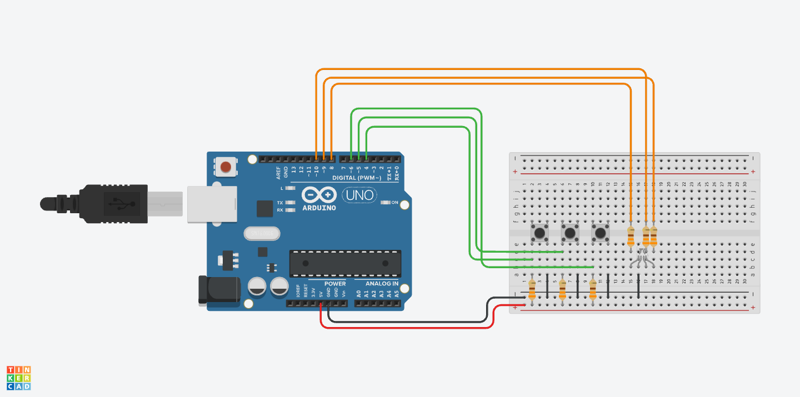
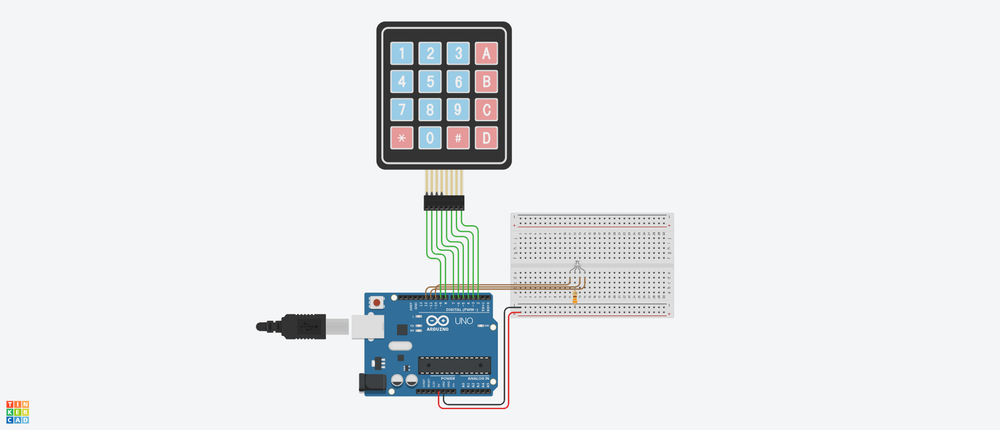

# Lab 13 - Digital To Analog

## Today Topics

1. [Input Button](01.Input.md)
2. [Keypad and Key Matrices](02.KeyMatrices.md)

## Today Exercises

**เข็คส่งงาน:** https://bit.ly/PhyCom2025Score

| ข้อ                      | รายละเอียด                                                                                                                                                                                                                                                                                                                                                                                                                                                      | ตัวอย่าง                        |
|--------------------------|-----------------------------------------------------------------------------------------------------------------------------------------------------------------------------------------------------------------------------------------------------------------------------------------------------------------------------------------------------------------------------------------------------------------------------------------------------------------|---------------------------------|
| **1. Color LED Switch:** | ต่อ Switch จำนวน 3 ตัว เมื่อกด switch แต่ละตัว ให้ Color LED ติดคนละสีเช่น Red, Green , Blue และเมื่อปล่อย switch ให้ Color LED ดับ      **Hint:**   - [Pull Up](https://www.tinkercad.com/things/eIF9FVqnx7H-l21-led-and-switch-pull-up?sharecode=yhk6NOJbJE11-tuehxgdLl0NhvozczwZtV4gJVTSrAc)   - [Pull Down](https://www.tinkercad.com/things/bk5DzidrknQ-l21-led-and-switch-pull-down?sharecode=ABUz4OiP6ag6g5-p-S4vjg-RUZhOdgmLqYdeUVlPG7A) |  |
| **2. Keypad (RGB):**     | **ต่อในโปรแกรม tinkercad แล้วส่ง URL ที่ต่อเสร็จใน onlearn**  จงเขียนโปรแกรมรับค่าจาก Keypad โดยให้แสดงสี ของ Color LED เป็นสีต่างๆ ตามปุ่มที่กด โดยกำหนดสีเองตามใจชอบ      https://onlearn.it.kmitl.ac.th/mod/assign/view.php?id=23541                                                                                                                                                                                                             |  | 

สไลด์ Lecture: [PC67-12_Micro02.pdf](files/PC67-12_Micro02.pdf)
