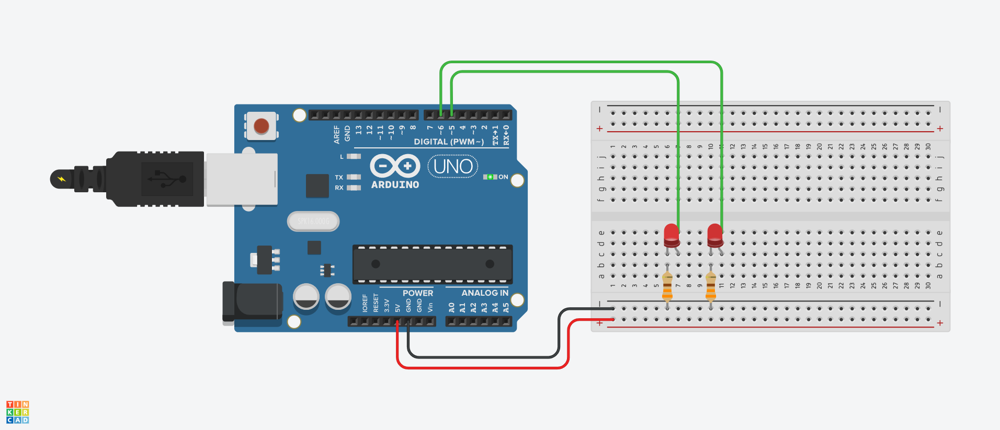
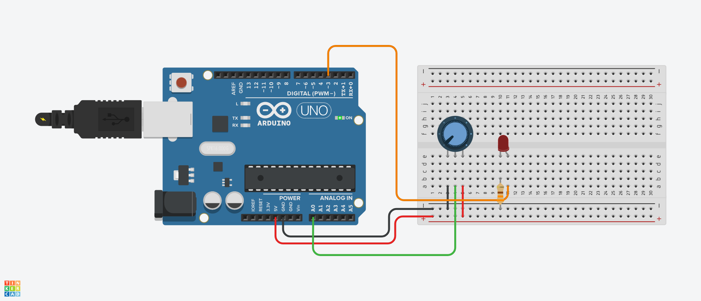
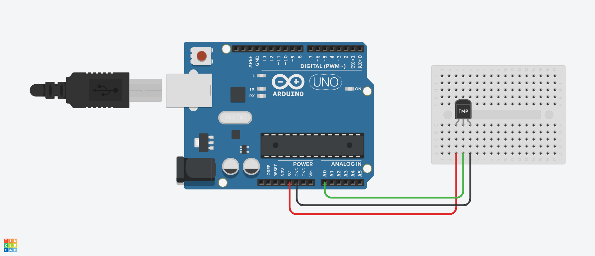
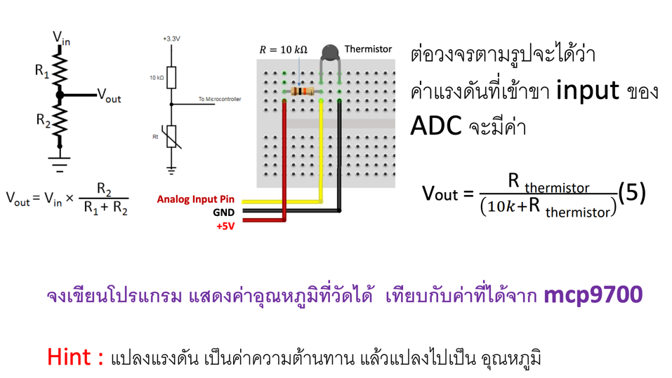
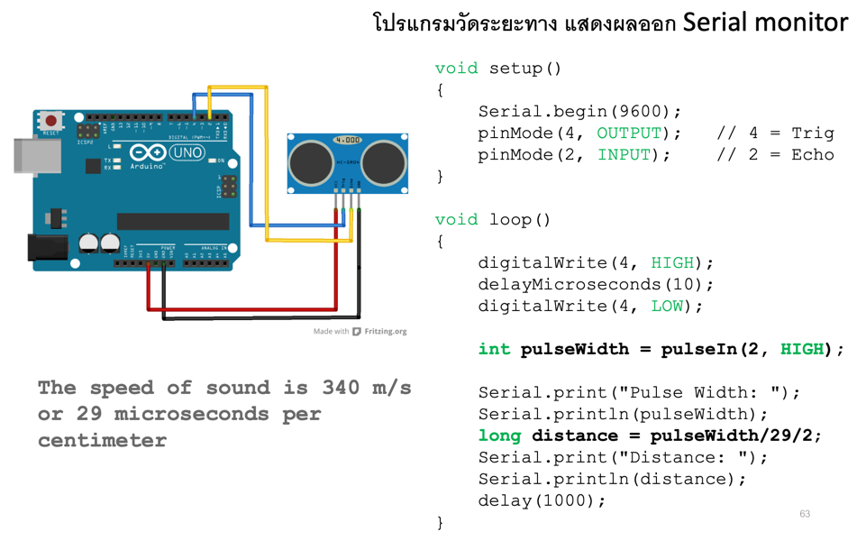

# Lab 14 - Analog Input & Output

## Today Topics

1. [Analog Signal](01.Analog%20Signal.md)

## Today Exercises

**เข็คส่งงาน:** https://bit.ly/PhyCom2025Score

| ข้อ                        | รายละเอียด                                                                                                                                                                                                                                                                                                               | ตัวอย่าง                                               |
|----------------------------|--------------------------------------------------------------------------------------------------------------------------------------------------------------------------------------------------------------------------------------------------------------------------------------------------------------------------|--------------------------------------------------------|
| **1. Analog LED Fading:**  | เลือกใช้ PWM Pin อื่นๆ เป็นจำนวน 2 Pin  - **LED1** Fading จาก Off ไปยัง Full-Bright   - **LED2** Fading จาก Off ไปยัง Full-Bright เร็วเป็นสองเท่าของ LED1     - **Hint:** [Tinkercad](https://www.tinkercad.com/things/ePJssgTI8Vo-l24-led-fading?sharecode=mkqe5jc0w5rYart6cIyuni-O2BlwSVwE-Mn0FLg6ev8) |  | 
| **2. Analog Reading:**     | ให้เขียนโปรแกรม Arduino เพื่อควบคุมความสว่างของ LED โดยใช้ Potentiometer เพื่อปรับค่าความสว่าง LED ให้มีการเปลี่ยนแปลงตามค่าที่ Potentiometer ปรับ     - **Hint:** [Tinkercad](https://www.tinkercad.com/things/ga6pNRFHVXI-l25-analog-reading?sharecode=kZHN-vveGuvqCZl4ss-zFi1ZmuD0M5KhiZzZYMhNxIc)            |  | 
| **3. Temperature Sensor:** | ต่อวงจร Sensor อุณหภูมิโดยใช้ MCP9700 และเขียนโปรแกรมแสดงค่าอุณหภูมิที่วัดได้บน Serial Monitor     - **Hint:** [Tinkercad](https://www.tinkercad.com/things/2OZqp7WO6Td-l26-temperature-sensor?sharecode=s-GGIAwVG3TqRgbwbsAaloo0osO_byVMoD4b76Ax77c)                                                            |  | 
| **4. Thermistor Sensor:**  | ต่อวงจร Sensor อุณหภูมิโดยใช้ Thermistor และเขียนโปรแกรมแสดงค่าอุณหภูมิที่วัดได้บน Serial Monitor                                                                                                                                                                                                                        |   | 
| **5. Ultrasonic Sensor:**  | โปรแกรมวัดระยะทาง แสดงผลออก Serial monitor      [Tinkercad](https://www.tinkercad.com/things/7sVWSqHZmEC-l28-ultrasonic-sensor?sharecode=YGwM0IgtLrhJ41O2_UwgA7_g8F9YB-5Wi8ZsL5fxdDI)                                                                                                                            |   | 

สไลด์
Lecture: [PC67-12_Micro02.pdf](../labs13-DigitalInput/files/PC67-12_Micro02.pdf)

